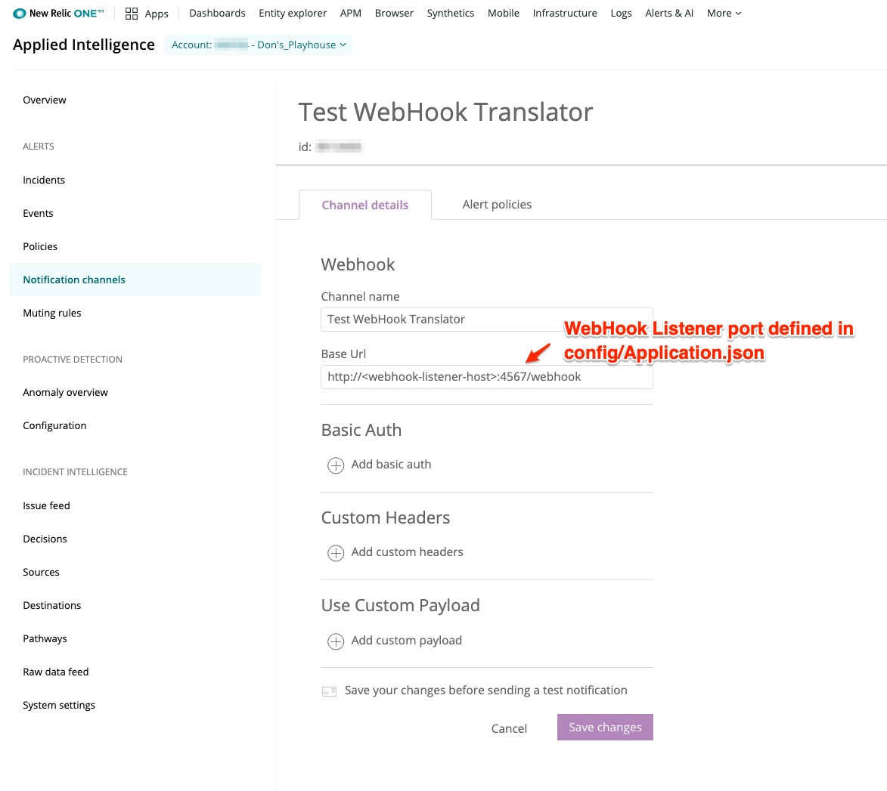

[](https://opensource.newrelic.com/oss-category/#experimental)

# newrelic-webhook-to-snmp-trap-java

This extension provides a Webhook Alert notification endpoint that converts a New Relic Alert into an SNMP Trap V2 format. This is hosted on-premises to allow direct integration to an SNMP Manager sitting behind a firewall. 

## Installation

Clone or download the [repository](https://github.com/newrelic-experimental/newrelic-webhook-to-snmp-trap-java.git). There is an executable JAR file included with the repo that you can run using the command:

```java -jar target/newrelic-wh2trap-server-1.0.0-SNAPSHOT-jar-with-dependencies.jar```

## Getting Started
1. Edit the config/Application.json to configure the Agent to connect to an SNMP Manager.
  - Modify the 'listenerPort' setting to change the port the Webhook listens on. If not set, the Spark Jetty Server defaults to port 4567.
  - Modify the agent stanza to change the SNMP Trap host, port, and community_string for the SNMP Trap destination. 
  - The Agent name is arbitrary.
  - You can specify multiple Agents for multiple Trap receivers. 
2. Edit the log4j.properties file to change the logging level or destination. Used logging levels are INFO (default), DEBUG. 
3. The build creates an executable JAR file. Run with the command: 'java -jar target/newrelic-wh2trap-server-1.0.0-SNAPSHOT-jar-with-dependencies.jar'. Be sure you are running with a Java 1.8 or higher JRE/JDK.

4. Create a [New Relic WebHook Alert Notification Channel](https://docs.newrelic.com/docs/alerts-applied-intelligence/new-relic-alerts/alert-notifications/notification-channels-control-where-send-alerts) to receive Alert notifications to the NRwh2Trap service. The "base Url" value for the WebHook channel should be of the form,

http://\<webhook-listener-host\>:\<webhook-listener-port\>/webhook.

Below is a screenshot of an example configuration: 



## Usage
The Agent is an executable JAR file. Run with the command: 'java -jar target/newrelic-wh2trap-server-1.0.0-SNAPSHOT-jar-with-dependencies.jar'. Be sure you are running with a Java 1.8 or higher JRE/JDK.


## Building

This is a Maven package so you can modify the code and build using "mvn install". 
This extension requires a Java 1.8+ JRE because it uses Lambda expressions. 

## Testing

The New Relic WebHook listener must be accessible from the Internet to receive Alerts from New Relic. You can test access using a browser:

- HelloWorld test: from a browser enter the URL, http://\<webhook-listener-host\>:\<webhook-listener-port\>/hello/world
      This should return the message "Hello World"

- Test Trap: from a browser enter the URL, http://\<webhook-listener-host\>:\<webhook-listener-port\>/testTrap
      This should return the message "Test Trap Generated"
   
If these tests fail then either the webhook listener process is not reachable or the NRwh2Trap process is not running, or both. To resolve: 
   - Ensure the process is started by running the process, java -jar NRwh2Trap.jar.
   - Make sure your WebHook listener host:port are public and can be reached from the New Relic Cloud Service.

## Support

New Relic hosts and moderates an online forum where customers can interact with New Relic employees as well as other customers to get help and share best practices. Like all official New Relic open source projects, there's a related Community topic in the New Relic Explorers Hub.

## Contributing
We encourage your contributions to improve newrelic-webhook-to-snmp-trap-java! Keep in mind when you submit your pull request, you'll need to sign the CLA via the click-through using CLA-Assistant. You only have to sign the CLA one time per project.
If you have any questions, or to execute our corporate CLA, required if your contribution is on behalf of a company,  please drop us an email at opensource@newrelic.com.

## License
newrelic-webhook-to-snmp-trap-java is licensed under the [Apache 2.0](http://apache.org/licenses/LICENSE-2.0.txt) License.
